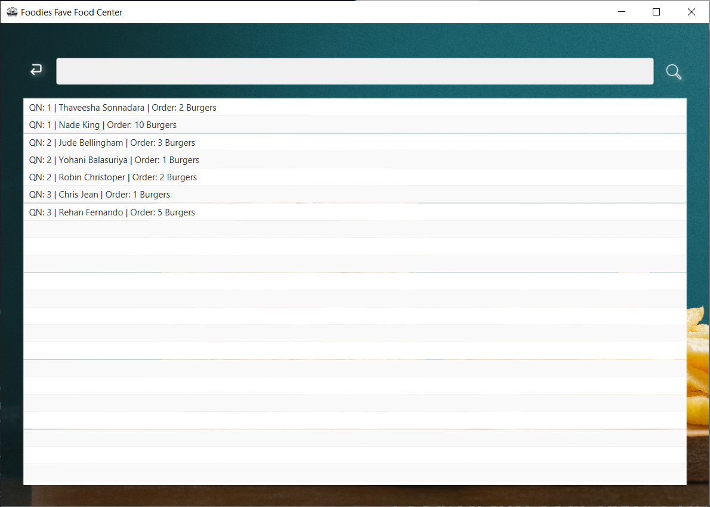

# FoodiesFaveFoodCenter_GUI
A GUI for a burger shop called Foodies Fave Food Center using Java &amp; JavaFX

## GUI

This is the home page of the application, which offers two options for a cashier to search a customer by his/her name(part of the name) and view all the cashier queues with real-time data.

Here's the Cashier Queues Page which shows each queue with the queue number as well as the current state of the queue. Additionally, this page will show the customers in the waiting queue section once the all queues are filled.

The search page allows the cashier to search a customer by his/her name to retrieve the quantity of the order as well as the queue number.
